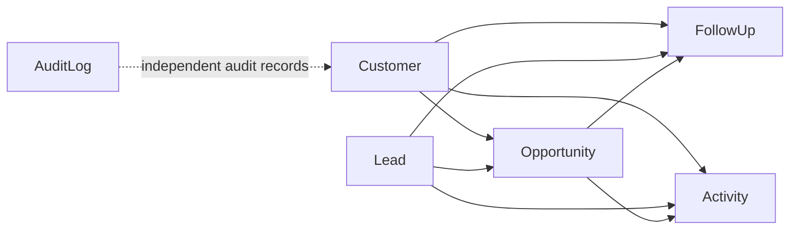

# AcxiomCRM

AcxiomCRM is a production-style ASP.NET Core CRM application being developed incrementally for a technical project assessment. The repository currently represents **Phase 2: database entities and EF Core**.

## Phase 2 Completed

- EF Core PostgreSQL provider installed and aligned with the current .NET 10 project.
- Domain entities created for Customer, Lead, Opportunity, FollowUp, Activity, and AuditLog.
- Controlled workflow enums added for CRM statuses, priorities, stages, types, and activity states.
- Explicit relationships, indexes, unique constraints, decimal precision, and restricted delete behavior configured.
- The initial migration was generated as `InitialCRMEntities`.
- No ASP.NET Core Identity, authentication, role, API, dashboard, report, or deployment functionality was added in this phase.

The environment contains .NET SDK 10, so the project targets `net10.0`. The environment does not contain a .NET 8 SDK; therefore, the Phase 1 framework adjustment remains necessary.

## Database entities



- `Customers`: customer profile, status, ownership metadata, and unique code/email/phone values.
- `Leads`: lead workflow, priority, source, expected value, and assignment.
- `Opportunities`: customer/lead relationships, amount, stage, probability, close date, and weighted value.
- `FollowUps`: scheduled follow-up records linked to customer, lead, or opportunity.
- `Activities`: activity history linked to CRM records.
- `AuditLogs`: append-oriented audit metadata. It is intentionally not connected to the Identity table in this phase.

## PostgreSQL configuration

The application reads the connection from `DATABASE_URL` first and otherwise uses `ConnectionStrings:DefaultConnection`. No real connection string is stored in source control.

For local development, provide either an environment variable or configuration value before applying migrations:

```powershell
$env:DATABASE_URL = "Host=localhost;Database=acxiomcrm;Username=...;Password=..."
dotnet ef database update --project AcxiomCRM\AcxiomCRM.csproj --startup-project AcxiomCRM\AcxiomCRM.csproj
```

The database update must not be run until a valid PostgreSQL connection is available. The generated migration is `20261008155251_InitialCRMEntities`.

## Important constraints

- Customer code, email, and phone are unique.
- Lead code is unique.
- Opportunity monetary values use `decimal(18,2)`.
- Lead expected value uses `decimal(18,2)`.
- Historical CRM relationships use restricted delete behavior to avoid accidental cascades.
- Audit logs remain append-oriented and do not have CRUD operations.
- Business rules such as amount greater than zero, probability range, past dates, and scheduled follow-up dates are deferred to Phase 3 services where appropriate.

## Build and validation

```powershell
dotnet restore AcxiomCRM.slnx
dotnet build AcxiomCRM.slnx --no-restore
.\dotnet-tools\dotnet-ef migrations list --project AcxiomCRM\AcxiomCRM.csproj --startup-project AcxiomCRM\AcxiomCRM.csproj
```

The migration tool was installed locally under `dotnet-tools`; it is not a production application dependency.

## Project folders

- `AcxiomCRM/Data`: EF Core context, design-time factory, and entity configurations.
- `AcxiomCRM/Models`: CRM entities and controlled enums.
- `AcxiomCRM/Migrations`: generated EF Core migration and model snapshot.
- `AcxiomCRM/Controllers`, `Services`, `Repositories`, `ViewModels`, `DTOs`, `Areas`, and `Views` remain reserved for later phases.

